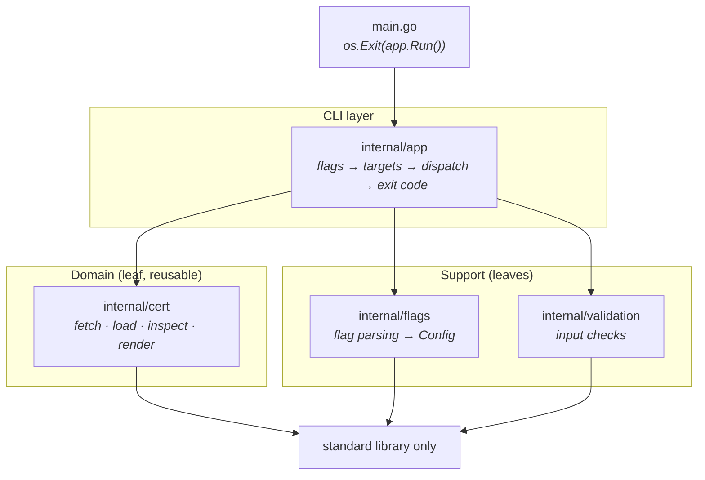
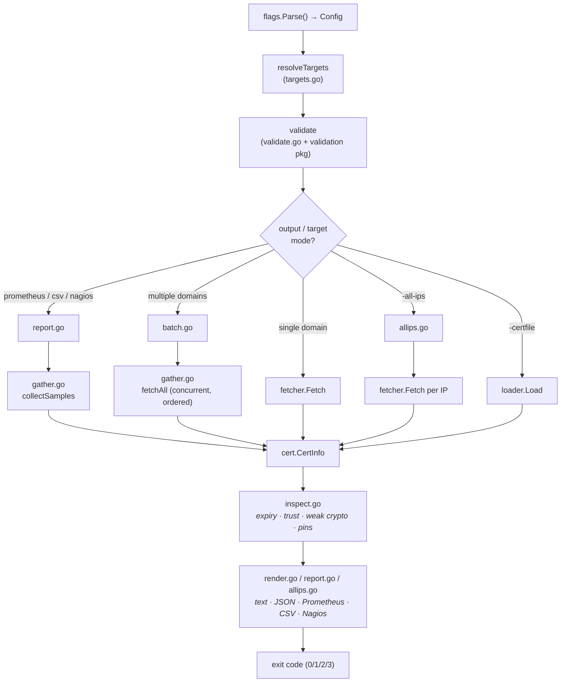
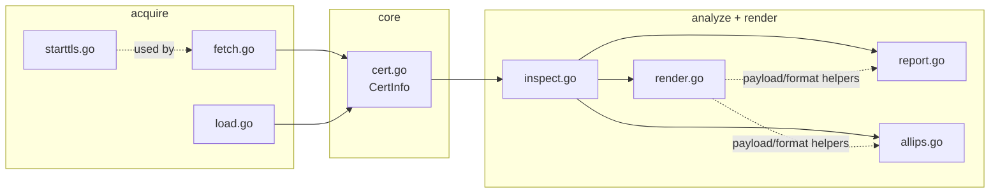

# Architecture

`ssl-watch` is a single-binary CLI that inspects and monitors TLS/SSL
certificates. The code is split into four small, focused packages under
`internal/`, plus a thin `main`.

The guiding rule: **`cert`, `flags` and `validation` are leaf packages** (they
import only the standard library). **`app` is the only package that wires them
together.** There are no import cycles, and the reusable certificate logic
(`cert`) never depends on the CLI.

## Package dependencies



Plain text, for terminals:

```
                 main.go
                    │  os.Exit(app.Run())
                    ▼
               internal/app ───────────────► internal/cert   (stdlib only)
                    │  │                       (fetch/load/inspect/render)
                    │  └────► internal/flags       (stdlib only)
                    └───────► internal/validation  (stdlib only)
```

| Package | Role | Imports internal? | ~LOC (src) |
|---|---|---|---|
| `main` | process entry point | `app` | 13 |
| `internal/app` | CLI body: parse → resolve → validate → dispatch | `cert`, `flags`, `validation` | ~800 |
| `internal/cert` | certificate domain (reusable library) | none (stdlib) | ~1700 |
| `internal/flags` | command-line flag parsing → `Config` | none (stdlib) | ~250 |
| `internal/validation` | input presence checks | none (stdlib) | ~30 |

## Request lifecycle



`CertInfo` is the spine of the system: every acquisition path (network fetch,
file load, per-IP fetch) produces a `*cert.CertInfo`, and every output path
consumes it.

## Inside `internal/cert` (the domain)

Organised as **acquire → analyze → render**:

| File | Responsibility |
|---|---|
| `cert.go` | core types (`CertInfo`, `FetchOptions`, `PrintOptions`, interfaces) + day arithmetic |
| `fetch.go` | acquire over TLS — dial, HTTP CONNECT proxy, chain verification |
| `starttls.go` | STARTTLS upgrade for `smtp`/`imap`/`pop3`/`ftp` |
| `load.go` | acquire from disk — PEM file/stdin, client certificate, CA pool |
| `inspect.go` | analyze a certificate — expiry, weak crypto, chain trust, fingerprints, pins |
| `render.go` | human-readable text and JSON output |
| `report.go` | monitoring formats — Prometheus, CSV, Nagios |
| `allips.go` | compare and render results across a domain's IP addresses |



> The output files (`render`/`report`/`allips`) share private helpers from
> `inspect.go` and `render.go`, so they form one cohesive cluster inside the
> domain rather than separable layers. This is why output is kept in `cert`
> rather than split into its own package — extracting it would force exporting
> ~15 internal helpers and break encapsulation.

## Inside `internal/app` (the CLI)

Organised as **setup → fetch → one file per output mode**:

| File | Responsibility |
|---|---|
| `app.go` | entry point — wiring (`Run`), dispatch (`run`), color, version, exit codes |
| `targets.go` | parse and resolve targets (`-domain`, `-domain-file`, ports, dedup) |
| `validate.go` | reject unsupported flag combinations |
| `gather.go` | fetch every target concurrently, results kept in input order |
| `single.go` | single-target output and its exit code |
| `batch.go` | multi-target aggregated output |
| `allips.go` | `-all-ips` mode (resolve + per-address) and reachability helpers |
| `export.go` | PEM export (`-pem` / `-export`) |
| `report.go` | Prometheus / CSV / Nagios output dispatch |

## Core types

| Type | Package | Purpose |
|---|---|---|
| `cert.CertInfo` | `cert` | retrieved certificate + chain + connection metadata + verification result |
| `cert.FetchOptions` | `cert` | how to connect/verify (timeout, STARTTLS, proxy, roots, client cert) |
| `cert.PrintOptions` | `cert` | how to render (short, JSON, threshold, color, chain, pin, expect-issuer) |
| `cert.PromSample` | `cert` | one target's result for Prometheus/CSV/Nagios output |
| `cert.IPResult` / `AllIPsResult` | `cert` | per-address result and the all-ips summary |
| `flags.Config` | `flags` | the parsed command line, passed read-only through `app` |

The `cert` package also exposes three interfaces — `CertificateFetcher`,
`CertificateLoader`, `CertificatePrinter` — which `app.Run()` wires to their
real implementations and `app`'s tests substitute with fakes.

## Exit codes

| Code | Constant | Meaning |
|---|---|---|
| 0 | `exitOK` | success |
| 1 | `exitError` | operational error: could not check, or invalid arguments |
| 2 | `exitSoft` | soft problem: expiring within `-threshold`, a `-strict` warning, or differing certs |
| 3 | `exitMismatch` | explicit expectation failed: `-pin` or `-expect-issuer` |

The Nagios output overrides these with Nagios plugin conventions (0/1/2).

## Extending

- **New output format** → add a writer in `cert/report.go` (or `render.go` for a
  human format), then a thin dispatcher in `app/report.go` and a case in
  `app/app.go`'s `run`.
- **New STARTTLS protocol** → add a case in `cert/starttls.go`
  (`negotiateStartTLS`) and its default port in `app/targets.go`
  (`starttlsPorts`).
- **New per-certificate check** → add the predicate in `cert/inspect.go` and
  surface it in `render.go` (text/JSON) and, if relevant, `HasWarnings`.

See also the file maps in each package's doc comment (`go doc ./internal/cert`,
`go doc ./internal/app`).
